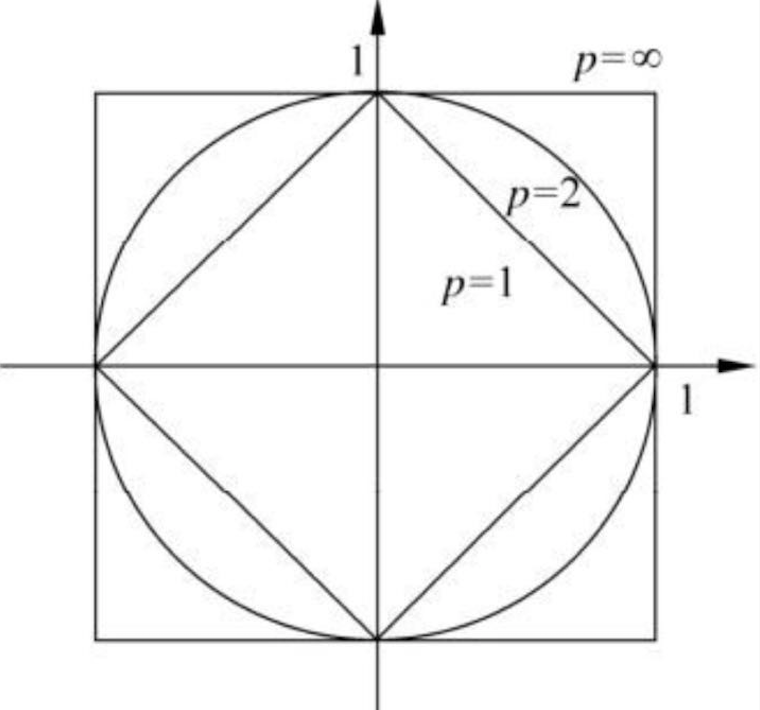
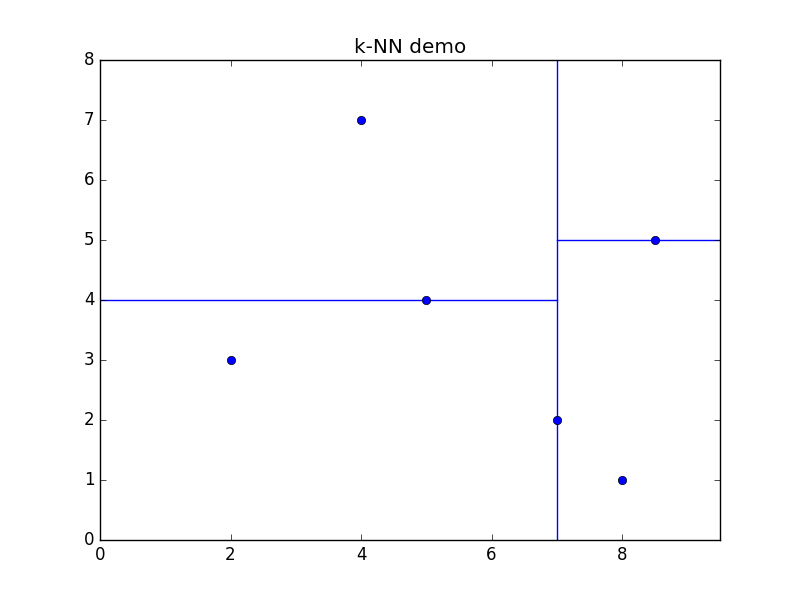
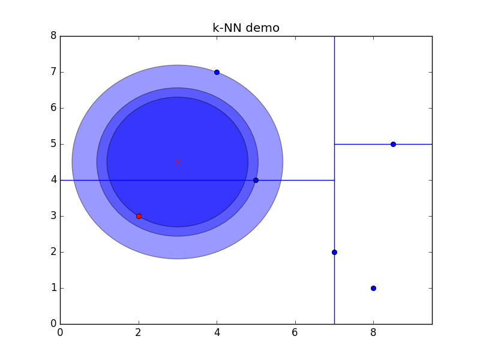

## 应用场景

k近邻法的输入为实例的特征向量，对应于特征空间的点；输出为实例的类别，可用取多类。其假设给定一个训练数据集，其中的实例类别已定。对新的实例，根据最近邻的 $$$k$$$ 个训练样本的类别，通过多数表决的方式判定该实例的类别。

## k邻近算法

 直观表述：给定一个训练数据集，对新的输入实例，在训练数据集中找到与该实例最邻近的k个实例，这个k个实例的多数属于某个类，就把该输入实例分为这个类。

> 输入

\\[T=\\{(x\_1, y\_1),(x\_2, y\_2),\cdots,(x\_N, y\_N)\\}\\]

其中，$$$x\_i \in x \subseteq R^n$$$为实例的特征向量，$$$y\_i \in y=\\{c\_1,c\_2,\cdots,c\_K\\}$$$ 为实例的类别， $$$i=1,2,\cdots,N$$$；实例特征向量 $$$x$$$；

> 输出

实例特征向量 $$$x$$$ 所属的类 $$$y$$$

> 算法

1. 根据给定的距离度量，在训练集$$$T$$$中找出与$$$x$$$最邻近的$$$k$$$个点，涵盖这$$$k$$$个点的$$$x$$$的邻域记作$$$N\_k(x)$$$；
2. 在$$$N\_k(x)$$$中根据分类决策规则决定$$$x$$$的类别；
	\\[\begin{aligned}
	y &= arg \max\_{c\_j} \sum\_{x\_j \in N\_k(x)} I(y\_i=c\_j) \\\
	I(y\_i=c\_j) &= \left\\{ \\begin{array}{cc}
  1 & \textrm{if } y\_i = c\_j \\\\
  0 & \textrm{else}
\\end{array} \right.
, i=1,2,\cdots,N, j=1,2,\cdots,K
	\end{aligned}\\]

## k邻近模型

k邻近法使用的模型实际上对应域对特征空间的划分。特征空间中，对每个训练实例点ix，距离该点比其他点更近的所有点组成一个区域，叫作单元。每个训练实例点拥有一个单元，所有的训练实例点的单元构成对特征空间的一个划分。实际划分方法由无穷多种，但一般按各特征维度进行划分比较容易。例如，二维空间按坐标轴进行划分。
由三个基本要素决定：

* $$$k$$$值的选择
* 距离度量
* 分类决策规则

## 距离度量

特征空间中两个实例点的距离是两个实例点`相似程度`的反映。

### $$$L\_p$$$距离

设特征空间一般是n维实数向量空间 $$$R^n$$$，$$$\mathbf{x}\_i,\mathbf{x}\_j \in X, \mathbf{x}\_i=(x\_i^{(1)},x\_i^{(2)},\cdots,x\_i^{(n)})^T, \mathbf{x}\_j=(x\_j^{(1)},x\_j^{(2)},\cdots,x\_j^{(n)})^T$$$

$$$\mathbf{x}\_i,\mathbf{x}\_j$$$的$$$L\_p$$$距离为

\\[
L\_p(\mathbf{x}\_i, \mathbf{x}\_j) = {\left(\sum\_{l=1}^n {|x\_i^{(l)} - x\_j^{(l)}|}^p\right)}^\frac{1}{p}, p \ge 1
\\]

当 $$$p=\infty$$$ 时，它是个坐标（特征）距离的最大值

\\[
L\_p(\mathbf{x}\_i, \mathbf{x}\_j) = \max\_l {|x\_i^{(l)} - x\_j^{(l)}|}
\\]



### 曼哈顿距离(Manhattan distance)

$$$p=1$$$时，$$$L\_p$$$距离称为曼哈顿距离。

\\[
L\_p(\mathbf{x}\_i, \mathbf{x}\_j) = \sum\_{l=1}^n {|x\_i^{(l)} - x\_j^{(l)}|}
\\]

### 欧式距离(Euclidean distance)

$$$p=2$$$时，$$$L\_p$$$距离称称为欧式距离。

\\[
L\_p(\mathbf{x}\_i, \mathbf{x}\_j) = \sqrt{\sum\_{l=1}^n {|x\_i^{(l)} - x\_j^{(l)}|}^2}
\\]

代码实现为

```
def distance(cls, source, target):
	"""计算欧氏距离"""
	d = 0.0
	for i in range(len(source)):
		d = d + (source[i] - target[i]) * (source[i] - target[i])

	return math.sqrt(d)
```

### k值的选择

* 如果选择较小的k值，学习的`近似误差`(approximation error)会减小，但`估计误差`(estimation error)会增大，预测结果对近邻的实例点过于敏感（如果近邻是噪声就糟了），容易发生过拟合，将会使得模型较复杂；
* 如果选择较大的k值，可用减少学习的估计误差，但学习的近似误差会增大。将会使得模型较简单；
* 如果$$$k=N$$$，那么无论实例是什么，都将简单地预测它为训练集中的多数类。是不可取的；
* 实际应用中，k值一般取一个比较小的值。用[交叉验证法](http://baike.baidu.com/link?url=wsBl8lbs1fi_zjMYeiG95qHsmZfmrm6dvtJXBvEUmVuB9vA_sXK5JqBSq-dknWUGPM7BN8uVVrbmwowAmkuD0_)来选择最优的k值；

### 分类决策规则

多数表决规则（majority voting rule）：

如果分类的损失函数为0-1损失函数， 对给定的实例 $$$x \in \mathbf{x}$$$， 其最近邻的k个训练实例点构成的集合$$$N\_k(x)$$$。如果该区域的类别是$$$c\_j$$$，那么误分类是

\\[
\frac{1}{k} \sum\_{x\_i \in N\_k(x)} I(y\_i \ne c\_j) = 1 - \frac{1}{k} \sum\_{x\_i \in N\_k(x)} I(y\_i = c\_j)
\\]

要是其最小即经验风险最小，就要使 

\\[\sum\_{x\_i \in N\_k(x)} I(y\_i = c\_j)\\]

最大，故多数表决规则等价于经验风险最小化。
 

## kd树

为了提高k近邻搜索的效率，可用使用kd tree来存储训练数据，以减少计算距离的次数。

### 构造kd树

kd树是二叉树，表示对k维空间的一个划分（此处的k区别kNN中的k）。

构造kd树相当于不断地用垂直于坐标轴的超平面将k维空间切分，构成一系列的k维超矩形区域。kd树的每一个节点对应一个k维超矩形区域。切分时一般选择选定坐标轴的[中位数](http://baike.baidu.com/view/170892.htm)作为切分点，这样得到的kd树是[平衡树](http://baike.baidu.com/view/1991667.htm)。

> 输入

\\[
T=\\{x\_1,x\_2,\cdots,x\_N\\}
\\]

其中 $$$x\_i = {(x\_i^{(1)},x\_i^{(2)},\cdots,x\_i^{(k)})}^T$$$，$$$i=1,2,\cdots,N$$$;

> 输出

kd树

> 算法

1. 构造根节点（对应包含T的k维空间的超矩形区域）。选择$$$x^{(1)}$$$为坐标轴，以T中所有实例的$$$x^{(1)}$$$坐标的中位数为切分点。将根节点对应的超矩形区域切分为两个子区域：
	* 右节点对应坐标$$$x^{(1)}$$$ 大于切分点的子区域；
	* 左节点对应坐标$$$x^{(1)}$$$ 小于切分点的子区域；
	* 切分点保存在根节点；
2. 重复：对深度位j的节点，选择$$$x^{(l)}, l=(j\mod k)+1$$$为切分坐标轴，以该节点的区域总所有实例的$$$x^{(l)}$$$坐标的中位数为切分点，将该节点对应的超矩形区域切分为两个子区域：
	* 右节点对应坐标$$$x^{(l)}$$$ 大于切分点的子区域；
	* 左节点对应坐标$$$x^{(l)}$$$ 小于切分点的子区域；
	* 切分点保存在根节点；

3. 直到两个子区域没有实例存在时停止；



### 搜索kd树

> 输入

已构造kd树；目标点x;

> 输出

x的k近邻

> 算法

1. 从kd树中找出包含目标点x的叶节点：
	1. 从根节点出发
	2. 递归地向下访问kd树：
		* 若目标点x的当前维的坐标小于切分点的坐标，则移动到左子节点，否则移动到右子节点；
		* 重复直到子节点为叶节点为止；
2. 将节点长存入k近邻的距离优先级队列，并记录最大距离；
3. 递归地向上回退，对每个节点：
	a. 如果该节点保存的实例点比当前队列的最大距离更近，则存入k近邻队列；
	b. 如果是叶节点，继续向上回退；
	c. 检查另一子节点对应的区域是否与以目标点为球心，队列最大距离为班级的超球体相交：
	
      * 如果相交，则在该侧节点的子树内搜索是否有更近的节点；
	  * 否则，继续向上回退；
		
4. 当退回到根节点时，搜索结束，队列中的即为k近邻节点；

如果实例点是随机分布的，kd树的搜索平均计算复杂度是$$$O(logN)$$$，N为训练实例数。当空间维数接近训练实例数时，他的效率会迅速下降，几乎接近线性扫描。




代码：
<https://github.com/yungoo/maching-learning-quiz/blob/master/knn/knn.py>


