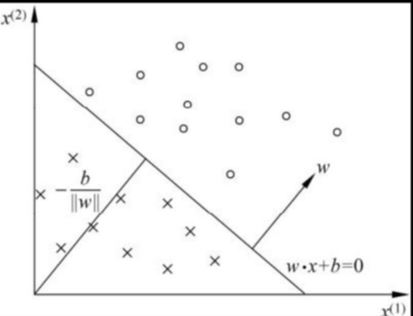
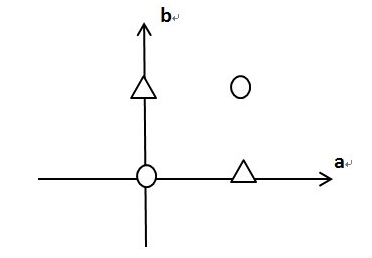
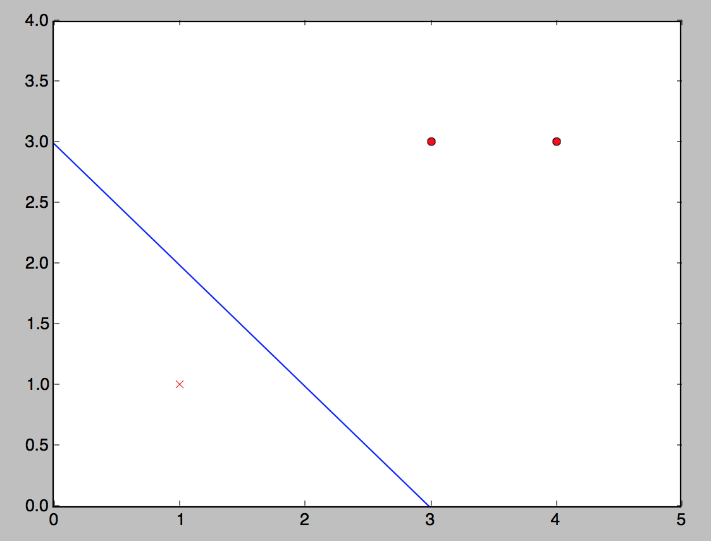

> 本文来自于阅读《统计学习方法》一书的学习笔记

感知机由Rosenblatt于1957年提出，是神经网络与支持向量机的基础。

## 感知机的使用场景

感知机是二类分类的线性分类模型，属于判别模型。

感知机主要用于求出将训练数据进行线性划分的分离超平面。例如：地面上散落了豆子和石子，且它们不相互掺杂，则只要把豆子和石子的`位置坐标`（特征向量）和`类别`（豆子的类别为 $$$+1$$$，石子的类别为 $$$-1$$$）作为感知机的输入，就可以计算出将豆子和石子分离的直线（超平面）。

## 感知机模型

假设输入空间（特征空间）$$$ \chi \subseteq R^n $$$，输出空间 $$$ \gamma \subseteq \\{+1, -1\\} $$$

输入 $$$\vec{x} \in \chi$$$ 表示实例的特征向量，对应于输入空间的点

输出 $$$y \in \gamma$$$表示实例的类别。

则 $$$\vec{x} \to y$$$的映射函数

\\[ y = f(\vec{x}) = sign(\vec{w} \cdot \vec{x} + b) \\]

称为`感知机`。其中：

\\[\begin{aligned}
\vec{w} & \in R^n \textrm{，叫做权值向量(weight vector)} \\\
b & \in R \textrm{，叫做偏置值(bias)} \\\
sign(x) & = \left\\{ \\begin{array}{cc}
  +1 & \textrm{if x > 0} \\\\
  -1 & \textrm{x < 0}
\\end{array} \right.
\text{，为符号函数}
\end{aligned}\\]

感知机的几何解释

上图示意：线性方程

\\[ \vec{w} \cdot \vec{x} + b = 0 \\]

对应于特征空间 $$$R^n$$$ 中的一个超平面 $$$S$$$，其中 $$$ \vec{w} $$$是超平面的`法向量`，$$$ b $$$ 是超平面的`截距`。位于超平面两测的点（特征向量）分别被分为正、负两类。因此，超平面 $$$S$$$ 称为`分离超平面（separating hyperplane）`。

** 感知机的学习 **

通过训练数据集（实例的特征向量和类别）

\\[ T = \left\\{ \left( x\_1, y\_1 \right), \left( x\_2, y\_2 \right), \ldots, \left( x\_N, y\_N \right) \right \\} \\]

其中，$$$ x\_i \in R^n, y\_i \in \gamma=\left\\{ +1, -1 \right \\}, i = 1,2,\ldots,  N $$$

求得感知机模型的参数 $$$ \vec{w}, b $$$。

** 感知机预测 **

通过学习得到的模型，对于输入实例给出其对应的输出类别。

## 感知机学习策略

### 线性可分数据集

如果某数据集满足

\\[ y = \left\\{ 
\\begin{array}{cc}
	+1 & \vec{w} \cdot \vec{x} + b > 0 \\\\
    -1 & \vec{w} \cdot \vec{x} + b < 0
\\end{array}\right.
\\]

则称它为`线性可分数据集`。

> 感知机的前提条件是数据集线性可分

`异或逻辑`就是线性不可分的。

画出异或逻辑的输入(X1,X2,Y)它们分布在三维立方体的顶面和底平面，将它们投影到XY平面可以看出，正负实例分布在交叉的对角线上，故而无法用某一直线将它们分开。

该图来自：<http://blog.csdn.net/panda07100/article/details/38580993>

### 感知机的经验损失函数

感知机采用误分类点到超平面 $$$ S $$$ 的总距离作为经验损失函数。

输入空间 $$$ R^n $$$ 中任一点 $$$ x_0 $$$ 到超平面 $$$ S $$$ 的距离为：

\\[ \frac{1}{ \parallel \vec{w} \parallel} | \vec{w} \cdot \vec{x\_0} + b | \\]

其中：

\\[ \parallel \vec{w} \parallel = \sqrt{ {w^{(0)}}^2 + {w^{(1)}}^2 + \ldots +  {w^{(n)}}^2 } \\]

为 $$$ \vec{w} $$$ 的L2范数。

对误分类的数据 $$$ \left( \vec{x\_i}, y\_i \right)$$$ 来说 

\\[  - y\_i \left( \vec{w} \cdot \vec{x\_i} + b \right) > 0 \\] 

恒成立，故误分类点 $$$ x\_i $$$ 到超平面 $$$ S $$$ 的距离为

\\[ - \frac{1}{ \parallel \vec{w} \parallel} y\_i \left( \vec{w} \cdot \vec{x\_i} + b \right) \\]

则感知机的经验损失函数为

\\[ L(\vec{w}, b) = - \frac{1}{ \parallel \vec{w} \parallel} \sum\_{\vec{x\_i} \in M} y\_i \left( \vec{w} \cdot \vec{x\_i} + b \right) \equiv -\sum\_{\vec{x\_i} \in M} y\_i \left( \vec{w} \cdot \vec{x\_i} + b \right) \\]

其中 $$$ M $$$ 为误分类点的集合，$$$ \frac{1}{ \parallel \vec{w} \parallel} $$$ 可以忽略。

## 感知机学习算法

感知机学习算法是误分类点驱动的，采用梯度下降法（stochastic gradient desent）。

### 原始形式

给定训练数据集（实例的特征向量和类别）

其中，$$$ x\_i \in R^n, y\_i \in \gamma=\left\\{ +1, -1 \right \\}, i = 1,2,\ldots,  N $$$，求参数 $$$ \vec{w}, b $$$，使其为以下经验损失函数的极小化问题的解

\\[ \min\limits\_{\vec{w}, b} {L(\vec{w}, b)} = -\sum\_{\vec{x\_i} \in M} y\_i \left( \vec{w} \cdot \vec{x\_i} + b \right) \\]

其中 $$$ M $$$ 为误分类点的集合。

算法：

`输入`：

训练数据集 $$$ T = \left\\{ \left( x\_1, y\_1 \right), \left( x\_2, y\_2 \right), \ldots, \left( x\_N, y\_N \right) \right \\} $$$， 其中 $$$ x\_i \in R^n, y\_i \in \gamma=\left\\{ +1, -1 \right \\}, i = 1,2,\ldots,  N $$$；学习率 $$$ \eta \(0 \lt \eta \le 1 \) $$$

`输出`：

\\[ \vec{w}, b \\]

得到感知机模型：

\\[ y = f(\vec{x}) = sign(\vec{w} \cdot \vec{x} + b) \\]

`步骤`：

1. 任选初始超平面 $$$ S＝(\vec{w\_0}, b\_0) $$$
2. 在训练集中选取数据 $$$ \left( x\_i, y\_i \right) $$$
3. 如果 $$$ y\_i \left( \vec{w} \cdot \vec{x\_i} + b \right) \le 0 $$$， 则更新
\\[\begin{aligned}
	\vec{w} & \gets \vec{w} + \eta y\_i \vec{x\_i} \\\
	b & \gets b + \eta y\_i \\\
\end{aligned}\\]
4. 转至 2，直到训练集中没有误分类点

示例：

代码请看：<https://github.com/yungoo/maching-learning-quiz/blob/master/perceptron/perceptron_primal.py>

### 对偶形式

根据原始形式的计算步骤，

\\[\begin{aligned}
	\vec{w} & \gets \vec{w} + \eta y\_i \vec{x\_i} \\\
	b & \gets b + \eta y\_i \\\
\end{aligned}\\]

逐步更新 $$$ \vec{w}, b $$$，设修改 $$$ n $$$ 次，则 $$$ \vec{w}, b $$$ 关于 $$$ (\vec{x\_i}, y\_i) $$$ 的增量分别是 $$$ a\_i y\_i \vec{x\_i} $$$ 和 $$$ a\_i y\_i $$$，其中 $$$ a\_i = n\_i \eta $$$，故

\\[\begin{aligned} 
\vec{w} & = \sum\_{i=1}^{N} {a\_i y\_i \vec{x\_i}} \\\
b & = \sum\_{i=1}^{N} {a\_i y\_i}
\end{aligned}\\]

其中 $$$ a\_i \ge 0 , i = 1,2, \ldots, N $$$，当 $$$ \eta = 1 $$$ 时，表示因误分类点而修过的次数。实例点更新次数越多，意谓它距离分离超平面越近，也就越难正确分类。

算法：

`输入`：

训练数据集 $$$ T = \left\\{ \left( x\_1, y\_1 \right), \left( x\_2, y\_2 \right), \ldots, \left( x\_N, y\_N \right) \right \\} $$$， 其中 $$$ x\_i \in R^n, y\_i \in \gamma=\left\\{ +1, -1 \right \\}, i = 1,2,\ldots,  N $$$；学习率 $$$ \eta \(0 \lt \eta \le 1 \) $$$

`输出`：

\\[ \vec{a}, b \\]

得到感知机模型：

\\[ y = f(\vec{x}) = sign(\sum\_{i=1}^{N} {a\_i y\_i \vec{x\_i}} \cdot \vec{x} + b) \\]

其中 $$$ \vec{a} = \(a\_1, a\_2,\ldots,a\_N\)^T $$$。

`步骤`：

1. $$$ \vec{a} \gets \vec{0},  b \gets 0 $$$
2. 在训练集中选取数据 $$$ (x\_i, y\_i) $$$
3. 如果 $$$ y\_i \left( \sum\_{j=1}^{N} {a\_j y\_j \vec{x\_j}} \cdot \vec{x_i} + b \right) \le 0 $$$， 则更新
\\[\begin{aligned}
	a\_i & \gets a\_i + \eta \\\
	b & \gets b + \eta y\_i \\\
\end{aligned}\\]
4. 转至 2，直到训练集中没有误分类点

为了方便，可以将训练集实例间的`内积`计算出了存储称为Gram矩阵

\\[ G = \left( \vec{x\_i} \cdot \vec{y\_i} \right)\_{N \times N} \\]

演示代码参照：
<https://github.com/yungoo/maching-learning-quiz/blob/master/perceptron/perceptron_dual.py>