> 论文地址：<https://raft.github.io/raft.pdf>
> 
> 网站：<https://raft.github.io>

Raft是一种为了管理日志复制的一致性算法（共识算法），比Paxos更简单易懂，容易落地。

## 1 介绍

- Strong leader: 比如日志只能由leader同步到followers。对应Paxos的Weak form leadership。
- Leader election: 使用心跳和定时器来触发选举过程
- Membership changes: 遇到分区割裂的时候，由多数派覆盖少数派的冲突配置

## 2 Replicated state machines(复制状态机)

Replicated state machines通常用replicated log实现。通过一致性算法保证日志复制的一致性，各服务器按相同的顺序记录command log，从而保证相同的状态和输出。

一致性算法通常需要具备：

* 安全(safety)：就算是网络延迟、网络分区、丢包、重复发包、乱序，返回给客户端的结果也必须是正确的
* 只要多数服务器正常，集群就是可用的
* 不要求校时就能保证一致性
* 少数低效服务器不会拖累整体服务的性能

## 3 Paxos的缺点

single-decree Paxos: Paxos定义协议保证各服务器就某个决定达成共识。

multi-Paxos: 组合多个single-decree的实例来就一系列的决定达成共识。

Paxos的复杂性来自于基于single entry的single-decree Paxos。

- 异乎寻常的难于理解

  Single-decree Paxos分为一言难尽而又无法各个击破的两个阶段，其实弃用single entry with multi-decision改用replicated log会更简单明了。
  
- 没有好的算法基础

  Lamport’s的论文主要说明了`single-decree Paxos`，而对multi-Paxos语嫣不详。各种实现`multi-Paxos`的算法各不相同，跟Lamport的构想也不一致。Chubby实现了类Paxos算法，但是并没有对外公布细节。因而目前并没有公认的`multi-Paxos`算法实现。
  
- Paxos架构难于落地
  
  选出一堆log entries再合并为有序日志，不但没有多少好处，反而增加了复杂性。如果基于日志构建系统，将log entrie按顺序插入队列会更简单高效。此外，Paxos基于对称p2p的实现方式鲜有人用，如果要就一序列的决定达成共识，更简单快速的方式是先选举一个leader，然后由leader协同达成各项决定。
  
各种Paxos的实现鲜有相似点，基本都是从Paxos开始，碰到各种困难，最后实现了明显跟预期不一样的架构。总之，现实世界的系统和Paxos论文描述的美好之间还有很长的距离。

## 4 为易懂而设计

目标：

* 提供一个完整并可以实现的基础算法
* 任何情况下都是安全并可用的
* 保证常用的操作高效

才用：

- 拆分问题，分而治之
- 简化状态空间(state space)，减少需要考虑的状态，让系统更合理并消除不确定性。
  
## 5 Raft一致性算法

Leader选举过程

1. 选举leader
2. 由leader全权负责管理复制日志

Log replication过程

1. leader接收client的command
2. 复制到其他服务器
3. 通知其他服务器应用log entries到状态机

Leader不需要跟其他服务器商量就可以决定是否复制log entries到某个服务器，数据流仅是单向的，由Leader到Followers。

Raft将`共识问题`拆分为三个子问题：

* Leader election
* Log replication
* Safety 保障各服务器应用日志到状态机的一致性

Raft特性：

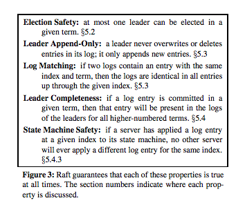

** Election Safety **

在给定的term内，最多只有一个leader被选出

** Leader Append-Only **

leader绝不会覆盖或删除其logs中的entries；它只会添加entries。

** Log Matching **

如果两个logs含有相同term和index的entry，则在该index之前的所有entries都是一致的。

** Leader Completeness **

如果log entry在给定的term内已提交，则该entry必定也存在于今后各term的leader的logs中。

** State Machine Safety **

如果某服务器已经应用某index的log entry到其状态机，则其它服务器永远不会应用一个跟该index相同的其它log entry。

### 5.1 Raft基础

基本设定：

* 服务器数量为奇数
* 任何服务器任何时刻只能处于三种角色之一：Leader、Follower、candidate
* 正常情况下最多只有一个Leader（split vote时没有Leader）
* Follower是被动的，只会接收请求不会主动发起任何请求
* Leader处理所有请求（Client发送给Follower的请求会被重定向到Leader）

Raft将事件划分为不同的term（周期序数，每一次成为Candidate都会递增，用做logical clock），从选举开始，到重新选举结束。如果发生split votes(谁也赢不了)，该term内无Leader（触发选举超时并重新投票)。各服务器维护了一个currentTerm状态，服务器间通讯时会比较并更新各自的currentTerm，保证相同的term。如果Leader发现自己的term过时了（小于对方term），会主动变成Follower。服务器会忽略term < currentTerm的请求。

状态切换

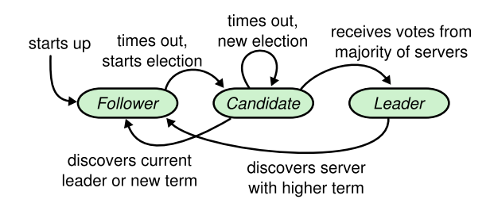

#### 状态机State

需存储状态（响应RPC之前存储）

| 属性 | 说明 |
| :----- | :----- |
| currentTerm | 最后一次看到的term服务器，初始化为0，单调递增
| votedFor | 接收到的当前term的candidate的ID，null表示没有 |
| log[] | log enteries，每一个entry包含状态机执行命令，leader接收log entry时的term(第一个为1)

易失状态

| 属性 | 说明 |
| :----- | :----- |
| commitIndex | 已提交的log entry的最大序号(初始为0， 单调递增)
| lastApplied | 已应用(applied)的log entry的最大序号(初始为0，单调递增)

Leader特有的易失状态(每次选举后都需要重新初始化)

| 属性 | 说明 |
| :----- | :----- |
| nextIndex[] | 待发送给各服务器的log entry序号(初始为leader最后log index + 1)
| matchIndex[] | 已复制给各服务器的log entry最大序号(始为0，单调递增)

#### RequestVote RPC

由candidate为收集选票而发起

| 请求参数 | 说明 |
| :----- | :----- |
| term | candidate的term
| candidateId | candidateid
| lastLogIndex | candidate最近接收的log entry的序号
| lastLogTerm | candidate最近接收的log entry所属的term

| 响应结果 | 说明 |
| :----- | :----- |
| term | 投票人确认的term, candidate用来更新自己的currentTerm ****
| voteGranted | 是否得到赞成票

投票者的实现逻辑：

1. reply false if term < currentTerm
2. if votedFor is null or votedFor == candidateId and candidate的log entry比投票人的log要新, 投赞成票

#### AppendEntries RPC

由leader复制log entreies给follwers，同时用做心跳包

| 请求参数 | 说明 |
| :----- | :----- |
| term | leader的term
| leaderId | follower将自己的clients重定型给该leaderId
| prevLogIndex | 处理的前一个log entry的序号
| prevLogTerm | 处理的前一个log entry的term
| entries[] | 需存储的entries(心跳包该属性为空)
| leaderCommit | leader的commendIndex状态

| 响应结果 | 说明 |
| :----- | :----- |
| term | 投票人的term, candidate用来更新自己的currentTerm（变为follower）
| success | 如果投票本地没有prevLog(判断index/term)，返回true

follower的实现逻辑：

1. Reply false if term < currentTerm
2. Reply false if 本地没有prevLog
3. if 已有的log和刚接收的log有冲突（index相同，但term不同）, 删除该log及其之后所有的logs
4. 将本地没有的新entries添加到状态机的log[]里
5. if leaderCommit > commitIndex, set commitIndex = min(leaderCount, index of last new entry)

#### InstallSnapshot RPC

由leader调用以发送快照数据块给follower。Leader总是按顺序发生数据块。

| 请求参数 | 说明 |
| :----- | :----- |
| term | leader的currentTerm
| leaderId | follower把客户端重定向到该id
| lastIncludedIndex | 快照替换所有的日志直到包含该index为止
| lastIncludedTerm | lastIncludeIndex的entry的term
| offset | 文件块在快照文件的偏移量
| data[] | 数据块
| done | 是否最后一块

| 响应结果 | 说明 |
| :----- | :----- |
| term | currentTerm，leader用来更新自己（revert to follower）

实现：

1. 如果term < currentTerm立即回应
2. 如果是第一个块(offset == 0)，创建快照文件
3. 将块写入文件到快照文件的指定位置(offset)
4. 如果done != true，回应请求并等待其它的数据块
5. 保存快照文件，丢弃index更小的历史快照或者残缺快照
6. 如果本地有log entry与快照中last Included entry相同的index和term，保留其后的log entries并回应
7. 丢弃整个log
8. 用快照中的内容重置状态机（并加载快照中的集群配置）

#### Rules for Servers

所有服务器：

* 如果commitIndex > lastApplied: 递增lastApplied, 应用log[lastApplied]到状态机
* if RPC请求或响应符合 term T > currentTerm: set currentTerm = T, 并把自己切换为follower

Follower:

* 响应Candidate和Leader的RPC请求
* 如果选举超时（没有收到Leader的AppendEntries心跳包）或者没有投赞成票给任何Condidate：成为候选人并发起选举投票

Candidates:

* 成为候选人后立即发起选举投票：
  * 递增currentTerm
  * 给自己投赞成票
  * 重设选举定时器
  * 给其他服务器发送RequestVote RPC
* 收到多数派的赞成票后成为Leader
* 收到新Leader的AppendEntries RPC后变为Follower
* 选举定时器超时后重新发起选举投票

Leaders:

* 选举成为Leader后：立即发送空的心跳包给各个服务器，并定时发送（避免Followers触发选举超时）
* 收到客户端的命令后：添加entry到本地日志，等待应用到状态机后再回应（需要先同步到Follower，多数Followers确认后）
* 如果最近log序号 >= 某Follower的nextIndex，发送AppendEntries RPC（log entries index >= nextIndex)给该Follower
  * 成功：更新Follower的nextIndex和matchIndex
  * 因为不一致失败：递减Follower的nextIndex并重试
* 如果存在N，同时满足 N > commitIndex 并且 多数派的matchIndex[i] >= N 并且 log[N].term == currentTerm：set commitIndex = N

### 5.2 Leader选举

Raft用心跳机制来触发Leader选举。服务器启动后，开始作为Follower，收到Leader或Candidate的有效RPC请求。Leader通过给所有的Followers定期发生心跳包来维护Leader地位。如果某个Follower超过一段时间没有收到心跳包，称之为选举超时，此时可以假定没有存活的Leader并开始选举自己作为新Leader。

开始选举前，该Follower递增其currentTerm并切换到Candidate角色。该Candidate先给自己投赞成票，然后并行发送RequestVote RPC请求给每一个服务器。Candidate保持Candidate角色，直到：

- 赢得选举
- 有其他服务器当选为Leader
- 长时间未产生Leader

当该Candidate在当前term内得到了集群内多数派的赞成票，该Candidate获胜。按照`先到先得`得宗旨，某个term内某服务器只能把票投给一个Candidate。多数派原则确保确定的term内最多只有一个Candidate能获胜。一旦获胜，该服务器立即成为Leader。然后，该Leader发送心跳消息给所有的服务器，从而确立地位并阻止新的选举。

等待选举结果过程中，Candidate可能会收到来自其他Leader发来的AppendEntries RPC消息。如果该Leader的term比Candidate的currentTerm大，该Candidate会承认该Leader的合法性并主动切换为Follower角色。如果RPC消息中term比Candidate的currentTerm小，Candidate拒绝该RPC请求并继续作为Candidate角色。

另外一个可能的结果是Candidate没有获胜也没有落败：如果有多个Followers同时成为Candidate，选票会被分裂以至于没有哪个Candidate能赢得多数票。这样，每个Candidate都会超时并递增其currentTerm并发送RequestVote消息以发起新一轮选举。然而，如果没有额外措施的话，split votes将会无休止的重复。

Raft用随机选举超时时间来确保split votes很少发生并且一旦发生可以被迅速解决。首先，为了避免split votes，选举超时从一个固定间隔范围内随机选取(150-300ms)。这将使各服务器的选举超时分散，如此，多数情况下某个时间点仅有单个服务器会触发选举超时；该服务器赢得选举并抢在其他服务器超时之前发送心跳消息。同样的机制也用来处理split votes。每个Candidate在开始选举的时候重设其随机超时定时器，然后等待该定时器超时；这种方式减少了新一轮选举中产生又一个splite vote的可能性。

> 备注：
> Leader完备性特性要求Leader必须有比集群中的多数派的日志全，那些日志比多数服务器落后的节点无法赢得选举。

### 5.3 Log复制

一旦选举出了Leader，该Leader就开始服务客户端的请求。每个客户端请求包含需要由Replicated State Machine执行的命令。Leader将命令作为一个新entry追加到log[]中，然后同时发送ApendEntries RPC消息给其他服务器以复制log entry。当安全复制该entry后，Leader应用其到状态机并返回执行结果给客户端。如果Followers崩溃、运行缓慢或者网络丢包，该Leader在全部Followers最终存储全部log entries前会一直重试ApendEntries RPC。

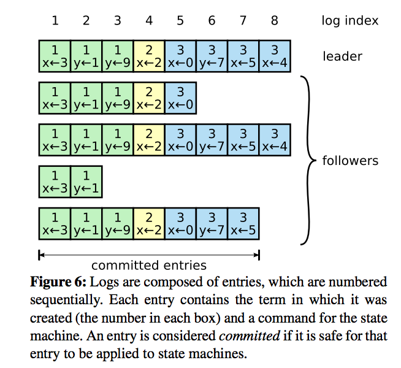

每个log entry保存了一条状态机命令，以及该entry被Leader接收时的term number。其中term number用来检测logs之间的不一致，以及用于实现`Log Matching`、`State Machine Safety`等特性。Log entry还有一个数值型的index表示在log[]中的位置。

由Leader决定何时安全的应用log entry到状态机，这时log entry的状态称之为committed。Raft保证committed entries是长期且最终会被所有有效的状态机执行。一旦某entry被Leader创建并复制到了多数派服务器，该entry就是`已提交的`了。同时也会把该Leader先前的log entry包括其前任Leader创建的一块提交了。Leader跟踪已提交日志的最大index，而且在即将发送的AppendEntries RPCS(包括心跳)的commitIndex设置为该值，以便其他服务器能够最终发现该日志已提交。Follower一旦获知某log entry已经提交，就应用到其本地的状态机。

设计了Raft日志机制来维护各服务器的日志，使其高度相关。该设计不但简化了系统的行为，使之更容易预见，而且还成为确保安全性的重要组件。Raft维护了如下特性，它们一起组成`Log Matching`特性：

- 如果不同logs的两个entries有相同的index和term，那么他们存了同样的命令(command)
- 如果不同logs的两个entries有相同的index和term，那么先前的entries的log是一致的

第一个特性符合事实：给定index和term，Leader最多创建一个entry，且log entries绝不会改变log中的位置。第二个特性由AppendEntries执行的简单一致性检查来保证。发送AppendEntries RPC时，leader会带上处理该entry时的index和term。如果Follower发现本地log中没有与该log相同的index和term，它会拒绝该entry。一致性检查使用归纳法：最初空的logs满足`Log Matching`特性，并且在logs扩展后一致性检查依然保持`Log Matching`。结果是，无论何时AppendEntries成功返回，Leader知道Follower的log跟自己log在新的entries是一致的。

正常运行时，Followers跟Leader的logs保持一致，所以AppendEntries的一致性检查从不会失败。然而，Leader崩溃会导致logs不一致（过去的Leader可能没有将log中的entries全部复制给Followers）。当一连串的Leader和Followers的崩溃会让这种不一致更加严重。

下图描述导致Followers与新的Leader的日志的几种情况：

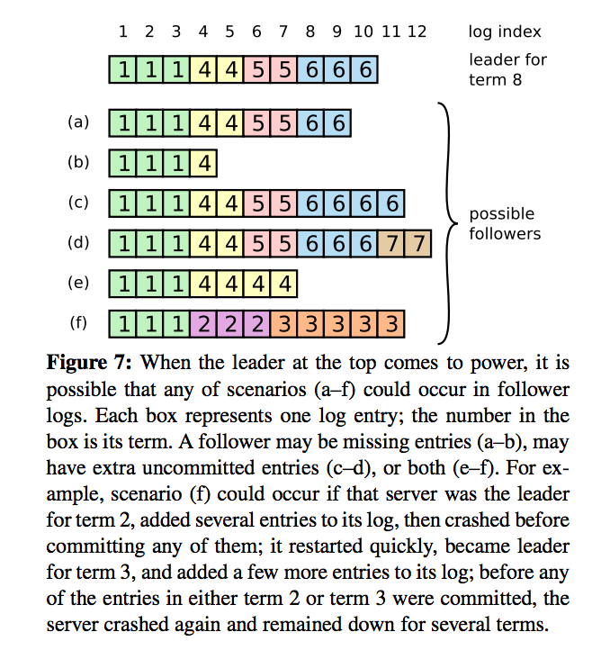

有可能Leader的某些entries在Follower里没有，也可能Follower的某些entries不在Leader的logs中，或者两者情况都有。遗失的和无关的log entries可能跨越了多个terms。

Leader通过强制Followers的logs从自己复制来处理不一致。这意谓Followers'logs中的冲突entries会被Leader logs的entries覆盖。只要结合几个约束条件，这就是安全的。

为了将Follower的logs回到和Leader中logs一致的状态，该Leader必须找到两者匹配的最后一条entry，删除Follower的logs中后面冲突的日志，并把Leader logs中该entry后面的entries发给该Follower。这些都是在AppendEntries RPCS的一致性检查中完成的。Leader为每个Follower维护了nextIndex，它是Leader要发送个Follower的下一个log entry的index。当Leader首次当选时，将所有的nextIndex初始化为logs中最后一个entry的index后一个值。如果Follower的log跟Leader的不一致，下一个AppendEntries RPC的一致性检查就会失败。Leader收到AppendEntries RPC失败后，会递减该Follower的nextIndex并重试AppendEntries RPC。最终Follower和Leader的nextIndex会相等并匹配成功。此时，AppendEntries会成功，将冲突的entries从Folloer的logs中删除并将从Leader收到的新的entries添加到本地logs中。一旦AppendEntries成功，Follower和Leader的logs就变成一致的了，在term接下来的时间内持续使用这个方法。

如果有需要，可以优化该协议以减少AppendEntries RPC被拒绝的次数。例如，当拒绝AppendEntries请求时，Follower可以返回冲突entry的term和该term中的第一个entry的index。有了这个信息，Leader能减小nextIndex并直接跳过term里冲突的entries；单个AppendEntries RPC就可以解决一个term内所有冲突的entries，比每个entry请求一次好得多。实践中，我们对这种优化方式的效果表示怀疑，因为这种失败很少见，并且不太可能产生多个不一致的entries。

通过这种机制，当Leader开始掌权后不需要采用任何特殊的措施就能恢复log的一致性。它只需要正常运行，logs会在AppendEntries一致性检查失败时自动汇集。Leader绝不会覆盖或者删除自己logs中的entries（Leader的｀Append-Only特性｀）。

这种Log replication machanism展示了需要的一致性属性：一旦多数服务器上线，Raft就可以接收、复制和应用新的log entry；新的entry在正常情况下能在一轮RPC请求中被复制到集群里；单个缓慢的Follower不会影响整体性能。

### 5.4 安全性

前面讨论了Raft如何推荐Leaders并复制log entries。然而，目前为止讨论的这些机制并不能充分的保证每个状态机都正好按同样的顺序执行相同的命令。例如：某个Follower可能在Leader提交某些log entries时不可用，后来又恢复了，进而超时，发起选举并当选为Leader，其他服务器将不得不覆盖该Follower没收到的那些entries；结果是，不同的状态机可能执行不同的命令序列。

一下几节通过对可当选的Leader添加约束来完善Raft算法。这些约束确保任意term内的Leader必须包含前一个term提交的所有log entries。有了这个选举约束，我们能够制定更精准的规则。最终，我们提出了`Leader完备性`特性的论证概括，并展示了其如何引导Replicated state machine的正确行为。

#### 5.4.1 选举约束

任何基于Leader的一致性算法，其Leader最终必须保存所有已提交的log entries。某些一致性算法，比如`Viewstamped Replication`，Leader即使刚开始并不包含全部的已提交的entries，却依然可以获选。这些算法有其它的机制可以标记出丢失的entries并把它们发给新的Leader，这有可能发生在是选举过程中或不久之后。不幸的是，这会引入更多附加机制和复杂性。Raft采用了一个简单的方法：保证从选举那一刻起，前一个term全部已提交的entries一定在新的leader里，不需要将这些entries再传给Leader。这意谓着log entries仅仅从Leader流向Followers，并且Leaders绝不会覆盖自己logs中已有的entries。

如果某个Candidate没有包含全部已提交的log entries，Raft采用voting process来避免的该Candidate赢得选举。Candidate要赢得选举必定要联络大多数服务器，这意谓各个已提交的entry必须存在于这些服务器上。如果Candidate的log比大多数服务器的至少要新（后面会精确定义up-to-date），那么它就一定持有所有已提交的entries。RequestVote RPC实现了这个约束：RPC包含了Candidate的log信息，投票者要走在自已的log比Condidate新的时候投拒绝票。

Raft通过比较logs中最后一个entry的index和term来断定两个logs的那个更新（up-to-date）。如果logs最后一批entries的term不相同，那么term更大的log相对更新。如果logs的term相同，那么哪个log更长(logs数量越多）哪个就更新。

#### 5.4.2 从上轮term提交entries

如5.3节所述，一旦大多数服务器的都存储了某个entry，Leader认为该entry在当前term是已提交的。如果Leader在提交某entry前崩溃，继任的Leader会尝试完成复制该entry。尽管上一轮term中的某entry在多数服务器存储时，Leader还是无法立即断定它是已提交的。Figure 8描述了这么一种情况：老的entry在大多数服务器上已存储（但未提交），但是仍然被后来的leader覆盖掉了。

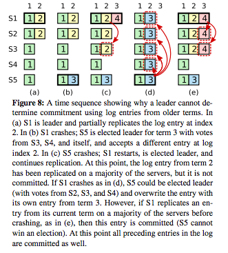

为了消除消figure 8这种问题，Raft绝不会依靠计算副本数来决定提交上个term的log entries。只有Leader当前term的log entries会通过计算已复制的副本数来确定提交与否；一旦当前term的某entry通过这种方式被提交，则先前全部的entries也间接的被提交（根据`Log Matching特性`）。有些情况下，Leader可以安全的归集已提交的老entry（例如：存储在各个服务器的的entry），但是Raft为了更简单而采用了保守的方法。

Raft引入这个种额外复杂性到在commitment rule中是因为：当Leader从上一个term复制entries时，log entries的term不变。在其它一致性算法里，如果新的leader从先前的“term”复制entries，其必须使用新的"term"。Raft的方式让跟踪log entries变得更容易，因为它们维护了跨越时间和logs的相同的term。另外，较其它算法而言，Raft中的新Leader只需要发送其它term中很少的log entries（其它算法一定要发送冗余的log entries以便在提交前重新编码"term"）。

#### 5.4.3 安全性论证

完整的Raft算法给出后，现在我们可以更准确的论证`Leader完备性`特性（讨论基于安全性证据；9.2节）。

我们假设它不具备`Leader完备性特性`，然后我们证明结论与假设矛盾。

假设term T的leader($$$leader_T$$$)在某term提交了一个log entry，但是该log entry尚未被后续term的leader存储。思考leader($$$leader_U$$$)没有存储该entry时最小的term U（U > T）。

1. 在$$$leader_U$$$当选的时刻，已提交的entry必定不在其的logs中。
2. $$$leader_T$$$已将该entry复制给了集群内的多数服务器，并且$$$leader_U$$$从集群内的多数服务器赢得了选票。因此，至少有一个服务器从$$$leader_T$$$接收了该entry并给$$$leader_U$$$投了赞成票，如Figure 9所示。该投票者是推出矛盾的关键。
3. 该投票者必定是在投票给$$$leader_U$$$之前接收了$$$leader_T$$$提交的entry；否则它应该拒绝$$$leader_T$$$的AppendEntries RPC请求（它的currentTerm应该比T大）。
4. 该投票者给$$$leader_U$$$投票时仍然保存了该entry，因为介于中间的每个leader包含该entry(根据假设推断出的)，Leaders绝不会移除这些entries，并且Followers也只在跟leader有冲突的情况下会删除。
5. 该投票者给$$$leader_U$$$投了赞成票，故$$$leader_U$$$的log必定要比该投票者要新。这条会引致两个矛盾项中的一个。
6. 其一：如果该投票者和$$$leader_U$$$在同一个term内，则$$$leader_U$$$的log必定至少跟该投票者的logs一样长，故$$$leader_U$$$的logs包含该该投票者所有的logs。这是矛盾的，因为该投票者包含了$$$leader_U$$$假设没有的entry。
7. 其次：$$$leader_U$$$最后的log term必定比该投票者大。此外，它也大于T，因为该投票者的最近term至少是T（包含来自term T的已提交的entry）。创建了$$$leader_U$$$最近log entry的先前的leader必定在其logs中包含了该已提交的log entry。因此，根据`Log Matching特性`，$$$leader_U$$$的log必定也包含了该entry，这也是矛盾的。
8. 至此反证完毕。因此，所有term > T的leaders必定包含了term T中已提交的全部的entries。
9. `Log Matching`特性间接地确保继任的Leaders同样会包含已提交的全部entries，如Figure 8(d)第index 2所示。

给出`Leader完备性特性`后，我们可以证明Figure 3中的`State Machine Safety特性`：如果某服务器已经应用某index的log entry到其状态机，则其它服务器永远不会应用一个跟该index相同的其它log entry。在某服务器应用某log entry到其状态机的那个时刻，其logs必定与Leader的logs中该entry之前的一致并且已提交。现在考虑任何服务器应用某指定index的log的最小term;`Leader完备性特性`确保所有更大term的leaders会存储相同的log entry，故稍后term应用该index的服务器会应用相同的值。因此，拥有了`State Machine Safety特性`。

最终，Raft需要服务器按log index顺序应用entries。结合`State Maching Safety`特性，这意谓全部服务器都会按相同的顺序应用相同的log entries集合到它们的状态机。

### 5.5 Follower和Candidate崩溃

到此为止，我们主要聚焦于Leader失效。Follower和Candidate崩溃比Leader崩溃更容易处理，而且处理起来是一样的。如果某Follower或Candidate崩溃，则接下来发送给它的RequestVote和AppendEntries RPC会失败。Raft通过无限重试来解决这类失败；如果崩溃的服务器重启了，则该RPC会成功完成。如果某服务器处理成功，但在返回前崩溃，则其将在重启后再次收到相同的RPC。Raft的RPC请求是幂等的，所以这种情况是无害的。举例说明，如果某Follower接收到一个包含已经存在于其logs中的entries的AppendEntries请求，它将会忽略该请求的entries。

### 5.6 定时和可用性

Raft其中一项需求是安全性不依赖于定时：系统不会只是因为某些事件比预期或快或慢的发生而产生不正确的结果。尽管如此，可用性（系统及时响应客户端请求的能力）免不了要依赖定时。例如：如果交换消息在服务器崩溃时花费比正常更多的时间，Candidate不会死等很长的时间来赢得选举；没有稳定的Leader，Raft无以为继。

定时是极其重要的一面体现在Raft的Leader选举。当系统满足如下定时需求时，Raft才能够选出并维护稳定的Leader：

\\[ broadcastTime << electionTimeout << MTBF \\]

在该不等式中：

\\[\begin{aligned} \\\
broadcastTime & 某服务器发生RPCS给集群内每个服务器并收到相应的平均时间 \\\
electionTimeout & 如5.2所述 \\\
MTBF & 单个服务器的多次失效之间平均时间 \\\
\end{aligned}\\]

broadcast time应当在比election timout小的数量级，如此Leader就能稳定的发生心跳消息以免Followers发起选举。考虑到选举超时时间采用随机的方式，这种不平均也让split vote变得不太可能。election timeout应当比MTBF略小一个数量级，以便系统稳定运行。当leader崩溃时，该系统将会在差不多整个超时时间内变得不可用；我们想让这部分时间只占了整个运行时间的一小部分。

Broadcast time和MTBF是底层系统的属性，而我们需要选择的是election timeout。Raft的RPC往往要求接收者保存信息到稳定存储器，所以broadcast time可能在0.5ms到20ms内浮动，具体依赖于存储技术。结果是，election timeout可能居于10ms到500ms之间。服务器的MTBF往往是数月甚至更久，其很容易满足定时的要求。

## 6 集群成员变化(Cluster memebership changes)

目前为止，我们假定集群的配置（参与一致性算法的服务器集合）是固定的。实践中，有时候有必要改变配置，比如为了替换某些坏掉的服务器或者为了改变复制的等级。尽管可通过将整个集群停机、更新配置文件，然后重启的方式完成，但这会让集群在转变过程中不可用。另外，如果需要很多人工处理步骤，这会增大操作错误的风险。为了避免这些问题，我们决定自动化改变配置并将其纳入Raft一致性算法。

为了让`配置改变机制`安全，在转变过程中，就务必不能在同一个term内存在两个leader同时被选出的可能性。不幸的是，任何将服务器直接从一个就配置转换为新配置的方法都是不安全的。不可能自动一次切换所有的服务器，所以，在转换过程中有潜在可能性会划分为两个独立的多数派（Figure 10）。

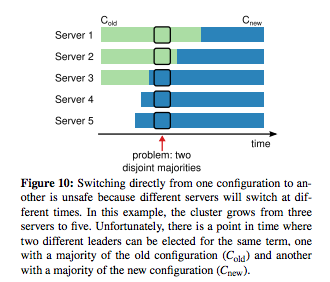

为了确保安全，配置改变必须分两阶段完成。有各种方式实现两阶段，例如，一些系统在第一阶段禁用旧的配置以使其不能响应客户端请求；然后在第二阶段启用新配置。在Raft，集群首先切换到称之为`joint consensus`过渡配置；一旦`joint consensus`被提交，系统就转换到新的配置。`joint consensus`组合新旧两个配置：

* Log entries在两个配置都被复制到所有服务器
* 任一个配置的任何服务器都可能成为leader
* 规则要求区别出新旧配置中的多数派

`joint consensus`允许服务器在不同时间不同配置之间转变，而无需妥协安全性。而且，`joint consensus`允许集群在配置转换时继续对外服务。

集群配置通过replicated log中特殊的entries存储并传输。Figure 11描述了配置改变的过程。

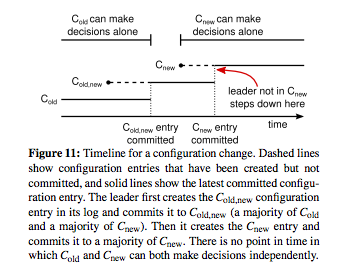

当Leader接收到将配置从 $$$C\_{old}$$$ 变为 $$$C\_{new}$$$ 的请求时，它为joint consensus将配置保存为一个log entry并用前面描述的机制复制该entry。一旦某服务器将该配置entry加入到logs，将在未来的决策中使用该配置（某服务器永远只会使用日志中最近的配置，不管该entry是否已提交）。这意谓着该leader将会使用$$$C\_{old,new}$$$的规则去判断$$$C\_{old,new}$$$的log entry是否已提交。如果该Leader崩溃，新的Leader可能从$$$C\_{old}$$$或$$$C\_{old,new}$$$中选出，依赖于获胜的Candidate是否收到了$$$C\_{old,new}$$$。在任何情况下，$$$C\_{new}$$$在这个时期不能做出单方的决定。

一旦$$$C\_{old,new}$$$被提交，不管$$$C\_{old}$$$还是$$$C\_{new}$$$都不能不经对方同意做出决定，并且`Leader Completeness`特性确保只有那些包含$$$C\_{old,new}$$$配置的log entry的服务器能被选为Leader。此时Leader可以安全地创建表示配置$$$C\_{new}$$$的log entry并复制到集群中。再次，该配置一经发现就在各服务器上生效了。当新的配置在$$$C\_{new}$$$的规则下被提交时，老的配置就无关紧要了，不在新配置中的服务器就可以关掉了。如Figure 11所示，不存在$$$C\_{old}$$$和$$$C\_{new}$$$能够作出单方面决定的时间；这就保证了安全性。

在重新配置中还有三个问题需要应对。第一个问题是新服务器可能刚开始并没有存储任何log entries。如果它们在该状态被添加到集群中，需要过好一段时间才能追赶上，在这段时间可能又有新的log entries提交。为了避免可用性gaps，Raft在配置变化前引入了附加阶段，在该阶段，新服务器作为无投票权服务器加入集群（leader会给它们复制log entries，但是不计入多数派）。一旦这些新服务器赶上了集群中其它的服务器，它们的处理就跟上面描述的一样了。

第二个问题是集群的Leader可能并不是新配置的一部分。这种情况下，Leader一提交完$$$C\_{new}$$$的log entry就下放（返回Follower角色）。这意谓着期间有一段时间（当正在提交$$$C\_{new}$$$时）该Leader管理着一个不包含自己的集群；它复制log entries但是自己不计入多数派；该Leader在$$$C\_{new}$$$被提交后才发生角色转换，因为这是新配置可以独立运行（能够从$$$C\_{new}$$$中挑选Leader）的第一时间点。在该时间点之前，它可能处在仅有$$$C\_{old}$$$的服务器能当选Leader的情形。

第三个问题是已删除的服务器（不在$$$C\_{new}$$$中）可能会扰乱集群。这些服务器收不到心跳包，所以它们会超时接着发起新的选举。它们会用新的term发送RequestVote RPC，这可能导致当前的Leader回到Follower角色。一个新的Leader最终会被选出，但是这些删除的服务器又会再次超时并且反复，导致极差的可用性。

为了避免这一问题，该服务器在它确定当前有Leader存在时不理会RequestVote RPC。具体说来，如果某服务器在一个收到当前leader的消息后的最小选举超时间隔内收到了一个ReqeustVote RPC，它不会更新当前的term或者投表决票。这不会影响正常的选举，正常情况下，服务器在开始选举前等待至少一个最小选举超时时间。不管怎样，这有助于避免被已删除的服务器扰乱：如果某leader能够发送心跳包到集群，则它就不会被更大的term罢免掉。

## 7 日志压缩

Raft的log随系统运行而增长，以便接受更多的客户端请求，但是在现实系统中，它并不可以无限增长的。当logs变得很长后，它需要占用更多的空间，并花费更多的时间去重放。如果没有任何机制去丢弃logs中累积的过时的信息的话，这将最终引发可用性问题。

快照是最简单的压缩方式。通过快照，整个系统的当前状态被作为快照写到稳定的存储器上，从而到该点的全部logs都可以丢弃。快照在Chubby和ZooKeeper都有被采用，该节的剩余部分将用来描述Raft的快照实现。

增量压缩方法，譬如log cleaning和log-structured merge trees，也是可行的。这些方法一次仅处理部分数据，所以它将压力均匀分散到了各个时间。先选择局部累积的已删除或覆盖的对象，然后重写该区域内活跃的对象使其更细密，最后释放该区域。比起快照，这需要高效的附加机制和复制性，快照通过只对整个数据集操作来简化问题。当要使用log cleaning可能需要对Raft进行修改，状态机可以实现与快照接口相同的LSM树。

Figure 12展示了Raft快照的基本思路。

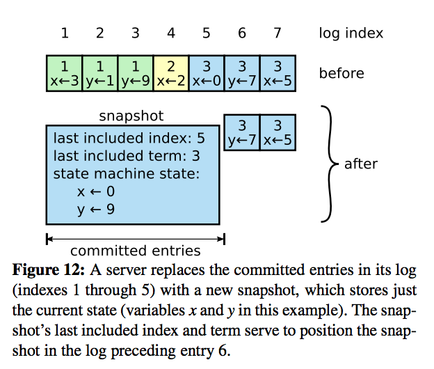

各服务器生成各自的快照，并只覆盖已提交logs中的entries。大多数工作变成了将状态机当前状态写入快照。Raft也在快照中包含了少量的元数据：lastIncludedIndex是快照替换后logs中最后一条entry的index（状态机中最后一条已提交的entry），且lastIncludedTerm是该entry的term。它们是为支持对snapshot后的第一条日志置信AppendEntries一致性检查而保留的，因为该操作需要前一个log entry的index和term。为了支持`集群配置变化`，快照还包含了log中包括最近entry的index的最新的配置信息。服务器一旦写完快照，就将logs中包含的最后的index之前的entries都删除，还有之前的快照。

尽管各服务器各自保存快照，Leader偶尔还是需要将快照发给落后的Followers。这种情况一般发生在Leader已经把需要发送给Follower的下一个log next压缩丢弃的时候。幸运的是，这种情况不常发生：跟上了Leader步骤的Follower应该已经有了这条entry。然而，某异常的缓慢的Follower或者新加入集群的服务器就可能发生这个问题了。让这些服务器跟上logs复制节奏的办法是给它们发送快照。

Leader通过一个称之为InstallSnapshot的新RPC来给落后的太多的Followers️发送快照，参见Figure 13。

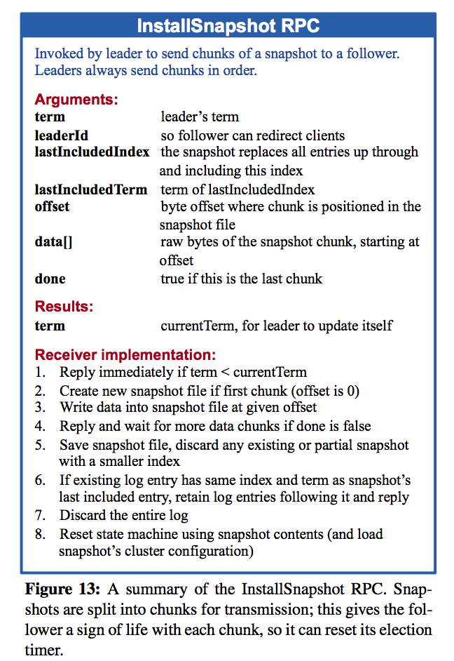

当某Follower收到RPC中的快照时，它要决定如何处理本地的log entries。一般快照会包含接受者log中没有的信息。这种情况下，Follower丢弃整个log；它们被快照取代，或许还有与快照冲突的未提交entries。相反，如果Follower收到了描述其部分logs的快照（由重传或错误导致），则快照涉及的log entries会被删除，而快照之后的entries仍然有效且必须保留。

快照与Raft的`强Leader原则`背道而驰，因为Followers可以不需要了解Leader就创建快照。我们认为这种背离的做法是正确的。当在Leader帮助下避免在达成共识过程中做出冲突的决定，当产生快照时就已经是一致的了，所以并不会存在冲突的决定。数据依然只是从Leaders流向Followers，只是Followers能够自己重新组装其数据。

我们考虑过一个基于Leader的替代方法，该方法只允许Leader创建快照，然后发送快照给所有的Followers。然而，它有两个缺点：其一，给每个Follower发送快照会浪费带宽并且会延缓生成快照的过程。每个服务起其实已经有了创建快照的所有信息，而且从本地log创建快照一般要比发送并接受快照来得划算；其二，Leader的实现会更复杂。比如：Leader需要在发送快照的同时给它们复制log entries，这样才不会堵塞客户端新请求。

还有另外两个问题会冲击生成快照的性能。首先，服务器必须决定合适生成快照。如果某服务器生成快照过于频繁，会浪费磁盘带宽和电能；如果不经常生成快照，有耗尽存储的风险，并且增加了在重启后重放日志的时间消耗。一个简单的策略是当log占用的存储达到某固定值时才生成快照。如果该值设得比预期的快照明显大很多，则生成快照占有的磁盘带宽就会很小。

第二个性能问题是写入快照需要花相当多的时间，而我们不想因此延迟正常操作。解决方案是采用copy-on-write技术，以便可以一边接收更新一边创建快照。例如，用函数式数据结构(funcational data structure)构建的状态机天然支持该技术。作为替换，操作系统的copy-on-write也可用于在创建状态机的内存快照（我们的实现就用的是该方式）。

## 8 客户端交互

这节描述客户端如何与Raft交互，包括客户端如何找到集群的Leader以及实现线性语义(linearizable semantics)。这类问题对所有的基于共识的系统都有用，而Raft的解决方案与其它系统无异。

Raft的客户端发送所有的请求给leader。当客户端首次启动时，它随机选择一个服务器尝试连接。如果客户端第一次选择的不是Leader，该服务器会拒绝客户端的请求并提供其获知的最近的Leader的信息（AppendEntries请求里有Leader的网络地址）。如果该Leader崩溃，客户端的请求会超时；此时客户端会再次随机选择一个服务器进行重连。

我们为Raft设定的目标是实现linearizable semantics（各个操作立即执行，在调用和响应之间仅且执行一次）。然而到目前为止，Raft可以多次执行某个命令；例如：如果某Leader在提交log entry之后且回应客户端之前崩溃，客户端会向新的Leader重试该命令，导致该命令再次被执行。解决方案是由客户端为每个命令分配一个唯一的序列号。如此，状态机跟踪各个客户端最近处理的序列号极其关联的响应即可。如果收到一个已经执行过的命令，它可以不经执行该请求而直接回应历史响应。

只读的操作可以无需写入任何信息到log而直接处理。然而，在没有额外的措施的前提下，这可能会有返回过时数据的风险，因为处理请求的该Leader可能已被其未察觉的新Leader取代。`线性读取`绝对不能返回过时的数据，Raft需要另外两个预防措施来保证`线性读取`无需访问logs。其一，Leader必须有已提交entries的最新的信息。`Leader完备性`特性能够保证Leader有所有已提交的entries，但是term刚开始的时候，它可能还不知道这些entries。为了找到这些entries，需要在该term提交entry。Raft通过让各个Leader在其term开始阶段提交一个空的`no-op`entry到logs来应对这个问题。其二，某Leader必须在处理`只读请求`前先检查该entry是否已经丢弃（如果有新的Leader被选出，其信息可能已经过时了）。Raft通过让Leader在响应`只读请求`前和给集群中的多数派发送心跳包来应对这个问题。作为替代，Leader可以依靠心跳机制来提供租约（form of lease），但是这要靠定时来实现安全性（需要假定时钟偏差在可控范围内）。

## 9 实现和评估

我们已经将Raft实现为Replicated state machine的一部分，其存储了RAMCloud的配置信息并辅助RAMCloud coordinator的进行故障转移。该Raft实现包含大约2000行C++代码，不包括测试代码、注释和空行。此源代码免费提供。基于本论文草案， 此外还有大概25个处于各种开发阶段的独立第三方开源Raft实现。此外，各类公司正在部署基于Raft的系统。

本节的剩余部分用三个标准来评估Raft：易懂性、正确性和性能。

### 9.1 易懂性

为了度量Raft相对于Paxos的易懂性，我们在斯坦福操作系统课程和伯克利分分布式计算课程上开展了一个对高年级本科生和研究生的实验性研究。我们分别拍摄了一堂Raft和Paxos的视频课程，然后做了相关的测验。Raft课程涵括本论文除日志压缩部分的内容；Paxos课程涵括足够创建一个同等的Replicated state machine的资料，包括single-decree Paxos，multi-decree Paxos，reconfiguration和实现时需要考虑的优化（譬如Leader选举）。测验测试了对算法基础的理解并要求学生论证corner cases。每个参与者先看其中一个视频，然后完成测验，再看另外一个视频，然后完成第二个测验。为了均衡个体成绩差异和前一部分学到的经验对测验结果的影响，我们让一半参与者先完成Paxos的部分，另外一半先完成Raft。我们比较了参与者每个测验的得分情况，来判断参与者是否对Raft理解得更好点。

我们让Paxos和Raft的比较尽量公平。该实验在两方面对Paxos有利：43个测试者中的15个之前已经有过Paxos的经验，而且Paxos的视频比Raft视频长14%。我们设法减少潜在偏见来源。

参与者在Raft测试中的平均得分要比Paxos测试高4.9分，Raft平均得分为25.7，Paxos评价得分20.8；Figure14展示了其各自得分。

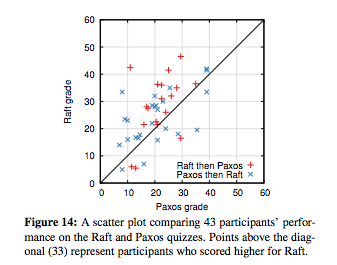

对偶T检验表明，有95%的置信度，Raft得分的真分布比Paxos得分真分布平均分至少高2.5分。

我们还创建了一个线性回归模型来预测新学生测验分数，基于三个因素：选择参加哪个测试、之前Paxos经验等级和学习顺序。该模型预测了实验选择会产生有利于Raft的12.5分的差异。这明显比观察到的4.9分差大，因为有些学生之前已经有Paxos的经验了，这很大程度帮助了Paxos，然而对Raft帮助甚微。奇妙的是，该模型还预测了已经参加了Paxos测试的人再参加Raft测试得分会低6.3分；尽管我们不清楚什么原因，该数值在统计上还是相当明显的。

我们还在测试后调查了参与者感觉哪个算法更容易实现或解释；结果显示在Figure15。

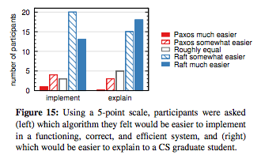

压倒性的大多数参与者告知Raft应该更容易实现和解释（33/44）。尽管如此，这些自评报告式的感觉并不会比参与者的实测分数更可信，而且参与者可能得知我们对Raft更易理解的猜测后具有一定的偏见。

### 9.2 正确性

我们在第5节为共识机制发明了一个正式规范和安全性证明。正式规范用TLA+规范语言做精确的的总结(Figure2)。其大概400行长并被用做主要证据。它对任何想自己实现Raft的人也是相当有用的。我们用TLA proof system机械地证明了Log Completeness Property。然而，该证明依靠尚未被机械地检查过的不变量（例如：我们没有证明该规范的类型安全性）。而且，我们写了一个State Machine Safety特性的非形式化证明，以证明其完备且相对精准（大概3500字）。

### 9.3 性能

Raft的性能跟其它一致性算法类似，比如Paxos。快速推举出Leader地位并复制新log entries，这是最重要的情形。Raft仅用了少量的几个消息就可以做到（从Leader到半数Followers的单个round-trip）。也有可能进一步改善Raft的性能。例如，可以轻易支持批量和管道化请求，以实现高吞吐和低延迟。其它算法的论文提供了各种优化方式；某些应该也可以用到Raft里，我们等以后来完成。

我们用自己的Raft实现来测量Raft选举算法的性能，然后回答两个问题：第一，选举过程是否能快速收敛？第二，Leader崩溃后能做到的最小停工时间是多少？

为了测量Leader选举，我们反复让拥有5个服务器的集群的Leader崩溃，并记录从检测到崩溃到选出新的Leader需要多少时间（Figure 16）。

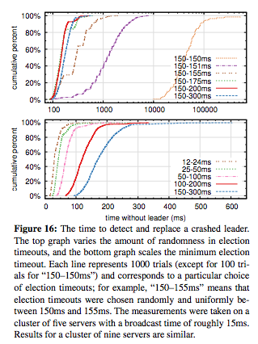

为了模拟最坏的情况，每次试验的服务器都有不同的logs长度，所以有些候选者不具备成为Leader的条件。而且，为了方便产生split votes，我们的测试脚本会在终止Leader进程前触发Leader发送同步的心跳包广播（类似Leader在崩溃前复制新log entry的行为）。Leader在其心跳间隔内随机同概率崩溃，该间隔为最小选举超时时间的一半。这样，可能的最小停工时间大约为最小选举超时时间的一半。

Figure16上半部分展示了给选举超时值小量的随机就能避免选举中的split votes。由于没有随机性导致大量的split votes，我们的测试中Leader选举始终超过10秒。仅仅添加5ms的随机量效果就很显著，结果是287ms的停工时间。采用更大的随机性能改善最差的行为：50ms的随机性得到最差的完成时间（超过1000次）是513ms。

Figure16的下半部分展示了通过减小选举超时时间可以减少停工时间。用12-24msd的选举超时时间，选举Leader平均仅用了35ms（最长的一次用了152ms）。尽管如此，比这更小的超时时间将会违背Raft的定时需求：Leader很难在这个时间内赶在其它服务器发起选举之前广播心跳包。这会导致不必要的Leader改变和更低的整体可用性。我们推荐保守的选举超时时间是150~300ms；如此一个超时时间不太可能导致不必要的Leader变更并且依然可以提高较好的可用性。

黄海洋@hangzhou 2016/08

